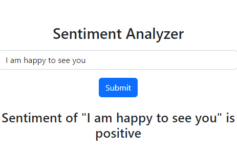
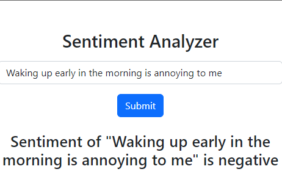
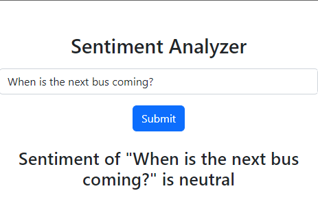

# Senitment-Analyzer-App

This project was bootstrapped with [Create React App](https://github.com/facebook/create-react-app).

# Purpose

I built a web application with a React.js frontend and Flask backend that connects to a machine learning algorithm that I created in order to detect text sentiment as positive, negative, or nuetral.

## Inspiration
In the current day, there is over 26,830 new Yelp reviews every minute. Reviews are critical for companies to evaluate products for their effectiveness. However, with so many reviews, understanding the reviews and the sentiment behind them is critical to improving a product. This is why I created a sentiment analyzer.

## Concept
I created a machine learning algorithm to predict sentiment, and then integrated it into a web application for ease of use as well as a sleek UI.

## How I built it

I built the algorithm using a Jupyter Notebook and libraries such as the Natural Learning Toolkit (NLTK) library, pandas, regular expressions (re), Sci-kit Learn, and the string library. After feature analysis and testing, I used a TFIDF vectorizer and tested various parameter settings with GridSearchCV as well as a 5-fold cross validation. I ended up with 80% accuracy. Then, I created the frontend with React. I used React-bootstrap for the CSS elements and then moved on to the backend. This was created using Flask. I created a function to process the data that the user enters and predict the sentiment.

Example images:

## Available Scripts

In the project directory, you can run:

### `npm start`

Runs the app in the development mode.\
Open [http://localhost:3000](http://localhost:3000) to view it in your browser.

The page will reload when you make changes.\
You may also see any lint errors in the console.
